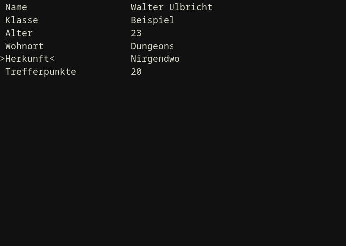

# HANS Character Sheet

This is a repository for HANS character sheet written in C and with [BarnabasBox](https://github.com/nmke-de/BarnabasBox). HANS stands for "Hundertseitige Attribute Nutzendes System", which is German and means "System using hundred-sided attributes".

See also: [HANSI](https://github.com/nmke-de/HANSI)

## But why?

Mostly to practice my programming skills.

## Where is the specification of the HANS system?

Incoming.

## Dependencies

- [BarnabasBox](https://github.com/nmke-de/BarnabasBox)
	- Its dependencies
- C compiler

## Build

Type `make`. Use `CC=your-favorite-compiler make` to change the compiler.

## Usage

**WIP**

Type `./main your-character-sheet` to begin. If the argument is omitted, the program will default to "CHAR" as the character sheet.

These are the keybindings:

| key      | action                                                     | comment                  |
| -------- | ---------------------------------------------------------- | ------------------------ |
| `j`      | Select next item                                           |                          |
| `k`      | Select previous item                                       |                          |
| `h`      | Go to previous mode                                        |                          |
| `l`      | Go to next mode                                            |                          |
| `g`      | Select first item                                          |                          |
| `G`      | Select last item                                           | `Shift g`                |
| `Return` | Change misc. value, name of stat or name of inventory item |                          |
| `+`      | Add 1 to current stat / attribute                          |                          |
| `-`      | Subtract 1 from current stat / attribute                   |                          |
| `J`      | Move current item down                                     | `Shift j`                |
| `K`      | Move current item up                                       | `Shift k`                |
| `*`      | Add new stat / inventory item                              | `Shift +` on my keyboard |
| `_`      | Remove current item on exit                                | `Shift -` on my keyboard |
| `q`      | Save and exit                                              |                          |
